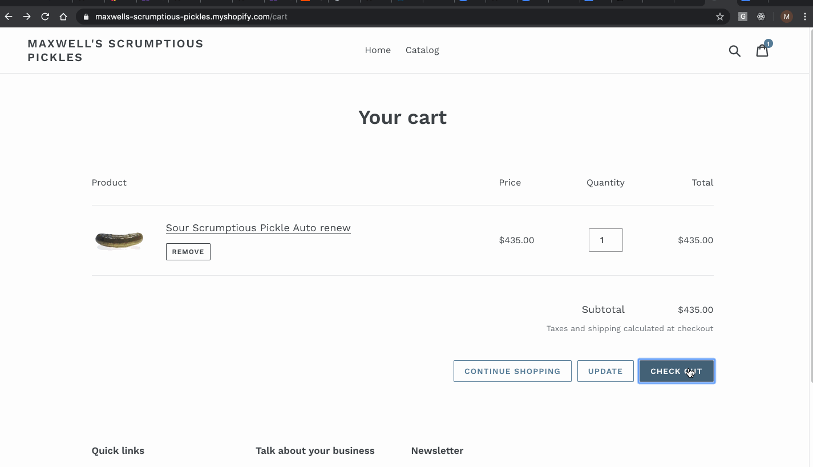

# dirty-rat-ssr

> My wonderful Nuxt.js project

## Build Setup

``` bash
# install dependencies
$ npm run install

# serve with hot reload at localhost:3000
$ npm run dev

# build for production and launch server
$ npm run build
$ npm run start

# generate static project
$ npm run generate
```

For detailed explanation on how things work, check out [Nuxt.js docs](https://nuxtjs.org).


## Running a ReCharge checkout
1. Update store widget code, specifically `snippets/subscription-cart-footer.liquid` such that it points to a locally running instance of `dirty-rat-ssr` like so:

```
		function buildCheckoutUrl(options) {
			// Build the Checkout URL
var checkout_url = 'http://localhost:3000/checkout-express` + '?',
				url_params = [
					'myshopify_domain=' + options.permanent_domain,
				];
			url_params = url_params
				.concat(get_cart_token())
				.concat(get_ga_linker());
			return checkout_url + url_params.join('&');
		}
		function filterVisible(elems) {
			// Return visible elements
			return elems.filter(function(elem) {
				return !!(elem.offsetWidth || elem.offsetHeight || elem.getClientRects().length);
			});
		}
```

2.) In preprod or prestage checkout and run the following branch in `customcheckout`: `feature/dirty-rat-backend-support`. Essentially all this does update the response on page 1 such that it returns a JSON payload instead of a template which containing everything `dirty-rat-ssr` needs to complete a checkout:

```
  return jsonify(
      cart_contents=cart_contents,
      translations=translations,
      general_attributes = json.loads(store.general_attributes),
      custom_header_logo_url = store.custom_header_logo_url,
      store_name = store.name,
      cart_id_or_token = cart_id_or_token, 
      braintree_paypal_client_token=store.braintree_paypal_client_token(),
  )
```

3.) Start preprod/prestage server.

4.) Checkout using store of widget code that was updated: 